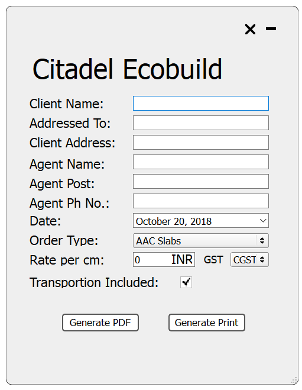
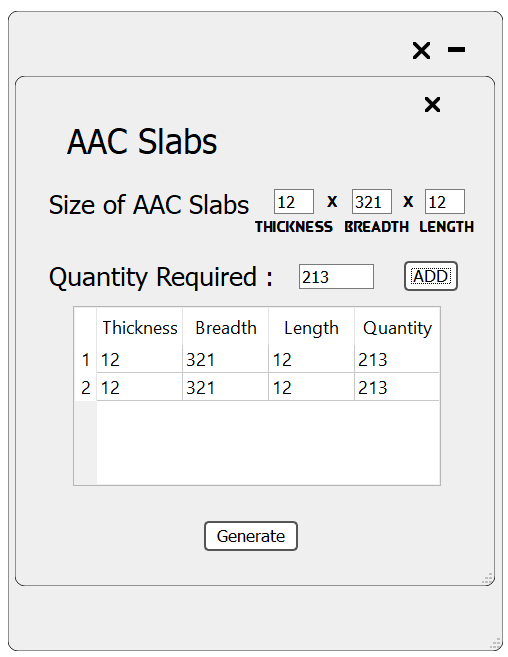
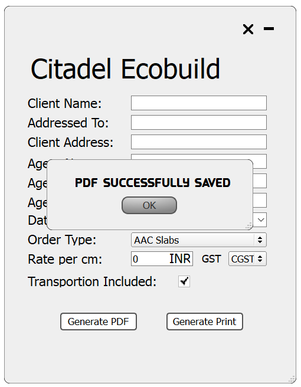

# Quotation Application
Application that will generate a PDF quotation document based on the information entered.

## Application Screenshots
</img> 
</img>
</img>


## Setup Instructions
### Assumptions

- You have Python 2.7

### Install Dependencies

```bash
$ pip install -r requirements.txt
# This will install all dependencies
```

## How to run

#### From source
Run runapp.py file
```bash
$ python runapp.py
```

#### From binary

Dowload and extract <a href="https://github.com/shubham-vernekar/quotationApplication/releases/download/1.0/quotation_Application_Windows.zip"> quotation_Application_Windows.zip</a>  
Run CitadelUI.exe file to start application

## Tools used
### <a href="https://pypi.org/project/reportlab/">Reportlab</a>
Used to generate PDF documents from python

### <a href="https://pypi.org/project/PySide/">Pyside</a>
Used to create GUI in python
